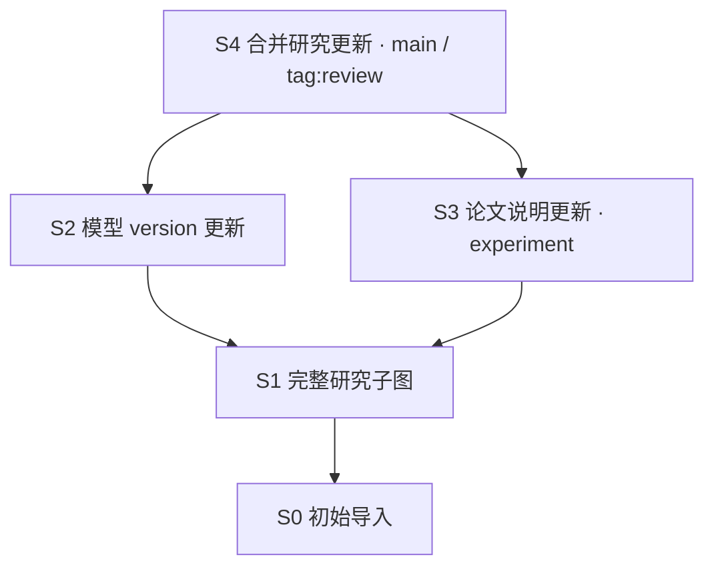

# Web 评审样例

<!-- cspell:ignore MMLU Arun pretraining -->

本文是 [Web 设计](web.md)的**非规范样例与评审输入**，不定义 KG OS 产品模型、默认数据、性能容量或 API。字段与关系均为调用方虚构的研究领域；正式 identity、端点方向与计数必须以实际返回数据为准。这里的 `n:/r:` 是假设在示例 Snapshot 已存在的原生 Ref，不能要求真实创建时分配这些 ID。

## 一个一致的研究子图

基准 State 用符号 `S4` 表示；实际请求必须换成真实 `commit/<64-lowercase-hex>`，`S4` 和截图 `a81c2f` 均不是合法 wire State。基准子图有 **18 Node、22 Relationship**，5 种主 Label 和 5 种 Relationship Type。以下表是完整子图的评审数据；部分查询应另标当前返回数量，不能直接沿用总数。

### 节点与属性

| Ref | Label | 主显示字段 `name` | 其它属性 |
| --- | --- | --- | --- |
| `n:1` | Model | Lumen-7B | parameters=`7B`，license=`Apache-2.0`，version=`1.2`，description=`通用研究语言模型` |
| `n:2` | Model | Lumen-3B | parameters=`3B`，license=`Apache-2.0`，version=`1.0`，description=`轻量研究语言模型` |
| `n:3` | Model | Solis-8B | parameters=`8B`，license=`MIT`，version=`2.0`，description=`代码与推理研究模型` |
| `n:4` | Model | Mira-7B | parameters=`7B`，license=`Apache-2.0`，version=`1.1`，description=`数学推理研究模型` |
| `n:5` | Paper | Lumen Technical Report | paper_id=`paper-lumen`，year=`2025`，description=`介绍 Lumen-7B 的训练与评测` |
| `n:6` | Paper | Efficient Alignment | paper_id=`paper-alignment`，year=`2025`，description=`介绍 Solis-8B 的对齐方法` |
| `n:7` | Paper | Sparse Reasoning | paper_id=`paper-sparse`，year=`2026`，description=`介绍 Mira-7B 的稀疏推理` |
| `n:8` | Paper | Retrieval at Scale | paper_id=`paper-retrieval`，year=`2024`，description=`研究规模化检索` |
| `n:9` | Paper | Stable Instruction Tuning | paper_id=`paper-tuning`，year=`2024`，description=`研究稳定指令微调` |
| `n:10` | Dataset | AsterCorpus | license=`CC-BY-4.0`，description=`多语言文本语料` |
| `n:11` | Dataset | CobaltCode | license=`MIT`，description=`代码训练语料` |
| `n:12` | Dataset | ThreadMath | license=`CC-BY-4.0`，description=`数学训练语料` |
| `n:13` | Benchmark | PrismQA | metric=`accuracy`，description=`问答评测` |
| `n:14` | Benchmark | AtlasMMLU | metric=`accuracy`，description=`多领域评测` |
| `n:15` | Benchmark | ReasonGrid | metric=`accuracy`，description=`推理评测` |
| `n:16` | Author | Mei Lin | affiliation=`Lumen Lab` |
| `n:17` | Author | Arun Shah | affiliation=`Solis Lab` |
| `n:18` | Author | Sofia Chen | affiliation=`Mira Lab` |

基准分布：Model 4、Paper 5、Dataset 3、Benchmark 3、Author 3。正文中的中文 Property 字段名只是表格说明；实际 keys 是表内英文键。`name` 是本领域选择的显示 Property，不是 Kernel 的必填业务字段；`paper_id` 是本领域业务唯一键，与 `n:5` 的数据库 identity 不同。模型 version 是普通知识属性，不是 KG OS State。

### 有向关系与属性

| Ref | Type | start → end | Property |
| --- | --- | --- | --- |
| `r:1` | AUTHORED | `n:16` → `n:5` | evidence=`lead author` |
| `r:2` | AUTHORED | `n:17` → `n:6` | evidence=`lead author` |
| `r:3` | AUTHORED | `n:18` → `n:7` | evidence=`lead author` |
| `r:4` | CITES | `n:8` → `n:5` | evidence=`section 2` |
| `r:5` | CITES | `n:5` → `n:6` | evidence=`section 4` |
| `r:6` | CITES | `n:7` → `n:6` | evidence=`section 3` |
| `r:7` | CITES | `n:9` → `n:5` | evidence=`section 5` |
| `r:8` | DESCRIBES | `n:5` → `n:1` | evidence=`main report` |
| `r:9` | DESCRIBES | `n:6` → `n:3` | evidence=`main report` |
| `r:10` | DESCRIBES | `n:7` → `n:4` | evidence=`main report` |
| `r:11` | TRAINED_ON | `n:1` → `n:10` | evidence=`pretraining` |
| `r:12` | TRAINED_ON | `n:1` → `n:11` | evidence=`code training` |
| `r:13` | TRAINED_ON | `n:1` → `n:12` | evidence=`math training` |
| `r:14` | TRAINED_ON | `n:2` → `n:10` | evidence=`pretraining` |
| `r:15` | TRAINED_ON | `n:3` → `n:11` | evidence=`pretraining` |
| `r:16` | TRAINED_ON | `n:4` → `n:12` | evidence=`pretraining` |
| `r:17` | EVALUATED_ON | `n:1` → `n:13` | score=`74.2` |
| `r:18` | EVALUATED_ON | `n:1` → `n:14` | score=`68.5` |
| `r:19` | EVALUATED_ON | `n:1` → `n:15` | score=`61.0` |
| `r:20` | EVALUATED_ON | `n:2` → `n:13` | score=`62.3` |
| `r:21` | EVALUATED_ON | `n:3` → `n:14` | score=`71.4` |
| `r:22` | EVALUATED_ON | `n:4` → `n:15` | score=`66.8` |

关系分布为 AUTHORED 3、CITES 4、DESCRIBES 3、TRAINED_ON 6、EVALUATED_ON 6。每条只有一个 Type，direction 以本表为准。两篇 Paper 未在这个子图中记录作者，不能凭图布局补作者边；出现一个作者关系也不说明该类型最多一位作者。

### 本体与组织

| Definition Ref | 字段声明 | 端点 / 附加规则 |
| --- | --- | --- |
| `node:Model` | description / license / name / parameters / version：STRING | name required + unique |
| `node:Paper` | description / name / paper_id：STRING；year：INTEGER | name required，paper_id required + unique |
| `node:Dataset` | description / license / name：STRING | name required |
| `node:Benchmark` | description / metric / name：STRING | name required |
| `node:Author` | affiliation / name：STRING | name required，不声明姓名唯一 |
| `relationship:AUTHORED` | evidence：STRING | `node:Author` → `node:Paper` |
| `relationship:CITES` | evidence：STRING | `node:Paper` → `node:Paper` |
| `relationship:DESCRIBES` | evidence：STRING | `node:Paper` → `node:Model` |
| `relationship:TRAINED_ON` | evidence：STRING | `node:Model` → `node:Dataset` |
| `relationship:EVALUATED_ON` | score：FLOAT | `node:Model` → `node:Benchmark` |

表内未声明的字段不是 required / unique。关系 Definition 即使只有可选 evidence，也满足至少一个字段的 profile；不能把“字段可选”改成“无字段 Definition”。该样例不增加 cardinality、caller-owned Vector Property 或额外领域身份。

三个 Domain 的直接成员如下，故意包含多父与 cycle，用于检查图形阅读：

| Domain Ref | includes |
| --- | --- |
| `domain:Research` | `domain:Evaluation`、`domain:Training`、`node:Author`、`node:Model`、`node:Paper`、`relationship:AUTHORED`、`relationship:CITES`、`relationship:DESCRIBES` |
| `domain:Training` | `node:Dataset`、`node:Model`、`relationship:TRAINED_ON` |
| `domain:Evaluation` | `domain:Research`、`node:Benchmark`、`node:Model`、`relationship:EVALUATED_ON` |

Model 有多个组织父级；Research ↔ Evaluation 成环。只展开直接成员并去重，不把 Domain 当数据访问限制。Domain 连线与关系端点连线是两种不同含义。

Model / Paper 同具有 description，共享全文索引 `research_text` 的完整声明在二者的 Definition 顶层可见。Model.description 的 `model_semantic` 为单字段托管语义索引；模型端只保存 String source，查询不先上传向量。

```yaml
name: "Model"
title: "模型"
description: "训练与评测中使用的研究模型。"
properties:
  - name: "description"
    type: "STRING"
    indexes:
      - name: "model_semantic"
        type: "vector"
  - name: "license"
    type: "STRING"
  - name: "name"
    type: "STRING"
    required: true
    unique: true
  - name: "parameters"
    type: "STRING"
  - name: "version"
    type: "STRING"
constraints: []
indexes:
  - name: "research_text"
    type: "fulltext"
    targets:
      - "node:Model"
      - "node:Paper"
    properties:
      - "description"
```

Paper 的声明同表，并在顶层包含完全相同的 `research_text` 声明。这表示一份共享资源；从其中任何 aggregate 显式删除整条声明都是全局删除，调整覆盖范围使用 targets，不用“删除当前引用”按钮代替。

Knowledge `r:17` 的 editable body 与 Definition endpoint Ref 明确分开：

```yaml
type: "EVALUATED_ON"
start: "n:1"
end: "n:13"
properties:
  score: 74.2
```

## 结果帧样例

以下 Cypher 用于表达查询输入与期望的局部视图；本次未在数据库执行。每次读取都将 `at` 绑定真实 S4 commit，实际结果和过程语法以 Lithograph 公开合同为准。例子使用有界结果，不承诺通用 Graph pagination。

| 帧 | 输入 / 返回类型 | 基准数据下的展示 |
| --- | --- | --- |
| A | 全部样例关系，返回 n / r / m | 22 rows；去重后 18 nodes、22 relationships；选中 `n:1` 的帧内检查器 |
| B | `MATCH (p:Paper) RETURN p LIMIT 20` | 5 rows、5 nodes、0 返回关系；不能补造 CITES 边 |
| C | 各 Model 的 name / version 标量 | 4 rows，默认 JSON；不强行生成 Model 节点 |
| D | 条件不匹配 | 完成 summary 后 0 rows，与查询失败分开 |
| E | 高级 execute 修改 version，不 RETURN | 实际 write summary / counters；无 affected IDs 承诺，之后查询 `n:1` 核对 |

帧 A：显式限制关系 Type，避免把本体内部 semantic graph 当成这个调用方样例子图；这是示例 Cypher 自身的选择，KG OS Graph 不隐式注入 filter。

```cypher
MATCH (n)-[r]->(m)
WHERE type(r) IN ['AUTHORED', 'CITES', 'DESCRIBES', 'TRAINED_ON', 'EVALUATED_ON']
RETURN n, r, m
LIMIT 80
```

帧 C：

```cypher
MATCH (m:Model)
RETURN m.name AS name, m.version AS version
ORDER BY name
LIMIT 20
```

从 `n:1` 展开邻居时用该帧 State，不用当前顶部另一个 State：

```cypher
MATCH (n)-[r]-(m)
WHERE elementId(n) = $id
RETURN n, r, m
LIMIT $limit
```

```json
{"id":"n:1","limit":80}
```

该子图中 `n:1` 有 7 条相邻关系，展开只增加尚未显示的元素，原 rows 计数不变；已加载全子图时仍是 18 / 22。按真实 element identity 去重，不拿语句返回 rows 数当 nodes 数。

帧 E 的高级执行明确选择 Branch，不能添不存在的 baseState 参数：

```cypher
MATCH (m:Model)
WHERE elementId(m) = $id
SET m.version = $version
```

```json
{"id":"n:1","version":"1.3"}
```

这是写入示例而非自动运行命令。成功时以实际返回 State 为准；若在 S4 后得到 S5，S4 中的 `n:1.version` 仍是 `1.2`。重跑帧 C 按 S4 读仍得旧值，按 S5 新跑才得 `1.3`。

## 版本、差异与草稿样例

以下是一个独立的、符号化 parent DAG；只表达可复用的评审场景，不把截图的短 hash 认作实际提交。



箭头指向 parent。S1 已有上面同一组 18 / 22 元素，但 `n:1.version=1.1`、`n:6.description=研究高效对齐`。S2 只将 version 改为 `1.2`，保留旧论文说明；S3 只将论文说明改为表内的 `介绍 Solis-8B 的对齐方法`，保留 version `1.1`。S4 合并二者，使用上面的完整属性表；没有增删节点关系。`diff(S1,S4)` 应显示这两处普通属性变化，不能凭“合并”标题伪造新增元素。S4 后显式移动 Tag 或设置 State Data 不改变这个 Snapshot diff。

| 输入 | 评审期望 |
| --- | --- |
| 在 S4 查询后切换到 S1 | 旧 S4 帧保持 version=1.2；新视图用 S1；两种重跑清楚标上下文 |
| S4 为 base 的 Model 表单把 version 改为 1.3 | 前端预览普通 Property 更新；真正提交用 baseState=S4、目标 Branch、canonical YAML Git Extended Diff |
| 草稿期间同 Branch 提交另一篇 Paper 的说明 | 即使 Model 未改，base 仍 stale；保留草稿、手动重建，不自动 replay |
| 删除 `n:1`，未明确处理相邻关系 | 高层 Patch reject；本样例 7 条边只是已完整列出的示例影响，不成为一般 preview API |
| 同 Patch 明确处理 `n:1` 及其 7 条边 | 可以提交明确目标变化，仍须遵守模型与 dependency 校验，不凭预览宣称一定成功 |
| 改 `r:17` endpoint 为 `n:14` | 显示可能 replacement；仅按真实返回 transition 使用新 `r:`，旧关系历史不自动串成新身份 |
| 从 Model 中删除整条 `research_text` | 全局删一份共享索引，Paper 同受影响；不删 description 正文或 Provider cache |
| 独立变体：未声明 unique 的 Dataset.name 已有重复数据，现收紧 unique | 后端数据验证可能失败；不自动去重、改名或增加 identity，不改基准 Model 已有的 unique |
| 另建关系 Definition，from=null、to=node:Paper、一个可选 evidence 字段 | 显示无来源类型限制；不是端点缺失错误，也不是“0 个字段” |
| 选定 S4 的 State Data 为显式 null 后 clear | 分别显示 hasData=true 与 false；都不改变 S4，也不进入 Snapshot Diff |

## 密集与异常输入

下面是用来补充静态图的前端评审输入，不是已通过的容量或可访问性测试。

| 输入变体 | 必须保留的辨别 |
| --- | --- |
| 额外的无 Label Node、带 Model + ResearchArtifact 两个 Label 的 Node | Node 允许 0..N Labels；图例显示标签重叠，不把类型数相加为元素总量 |
| 平行 CITES、自环 CITES、仅返回 Relationship | identity 和方向可选中；缺 endpoint payload 标未加载，不造字段 |
| 中英混合长 title、超长提交 message、多 Tag、64 字符 hash | 紧凑展示与完整值访问同时可用，不挤掉操作和 focus |
| Scalar / Map / List / Path / Raw Vector / Integer64 | 按真实 JSON v1 类型展示，图值与非图值共存；大整数不转换成失真的 Number |
| 1000 个可分页 ancestry 节点、8 条以上轨道、parent 跨页 | 只布局可见窗口，边界能继续加载；不要求一次获得全图，不补假 parent |
| 零行 / 首事件前错误 / rows 后 error / 缺 terminal / 用户取消 | 完成、失败、部分和取消区分，局部数据范围清楚 |
| 401、提交时断连、daemon 换端口、刷新后恢复或导入旧草稿 | 不发明账号过期；重新提供 token 后读取同 `.kgos` 已保存记录，写入结果未知不自动重发，草稿先核对库绑定与原 base |
| Merge 的 delete/update、同 path 多 conflict、显式 null、自定义 value 非法 | opaque conflictId 与 revision 保持；缺字段和 null 分开，解决失败保留输入 |
| `MERGE_SESSION_CHANGED`、`BRANCH_HEAD_MOVED`、finalize 校验失败 | 重读实际 Session，保留人工提案，不自动移到新基底；关闭不是 abort |
| 200% zoom、320px 窗口、键盘、减少动态效果 | 帧 ownership 不变、遮罩焦点可关闭、图可二维平移、文本与表单可重排 |
| 点击运行后修改语句 / 切版本，或顶部正在解析新引用 | 新帧冻结运行瞬间的完整请求；解析期间暂停新运行，顶部切换不废弃旧帧流 |
| 一个 chunk 已缓冲多个 row / summary，首 row 后取消或关闭 | 先设本窗口取消 / closed 状态并失效 generation，再 abort；迟到事件不恢复完成、打开或保存旧帧，不能仅 break iteration |
| 同帧选中 A 后立即选 B，A 属性请求最后返回 | 同时核对 frame State、selected Ref 与 selection generation，B 检查器不被 A 覆盖 |
| 单 event 超过 1 MiB、多帧累计 rows 或活跃流超出预算 | SDK parse 前有界分块 / 字节检查，触顶停止接收、显示部分结果；排队任务保持原快照，execute 不承诺回滚，不写完整缓存 |
| CLI 推进或删除当前 Branch，页面持续可见 | 低频 / focus 观察显示新 head 或引用不存在；当前 pinned commit、历史帧与旧分页不自动改变，不静默切 main |

## Web 持久数据与恢复输入

下列只核对 [Web 存储方案](web.md#web-工作区数据)，不表示当前 daemon / SDK 已支持，也不把 UI 记录变成 State Data 或 Snapshot。

| 输入 | 评审期望 |
| --- | --- |
| S4 草稿已确认保存，刷新并重新提供 Bearer | 恢复原 Branch / baseState=S4、精确 canonical base 与未完成文本；重读原 base 和 head，不能把新 head 自动写进草稿 |
| 参数 JSON 或 YAML 写到一半并 autosave | 按 UI 文本保存；可提交性另校验，不能因输入未完成丢弃记录 |
| 输入尚未确认保存，用户关闭页面 | 显示未保存风险并提供导出；不保证关闭事件能完成最后写入 |
| 两窗口读取同 draft revision=7，A 保存后 B 保存旧版 | B 得 `WEB_DATA_CHANGED` 并保留本地文本；对照新版、另存副本或显式选择，不盲目使用新 revision 覆盖 A |
| 两窗口分别编辑不同 draft；一条 draft 被显式删除后旧窗口保存 | 不同记录可各自成功；deleted ID 拒绝复活，不能把已删除 ID 当新建 |
| 保存响应丢失，随后 record revision 增加 | 需核对 lastMutationId 和内容；其他窗口保存也能增加 revision，不能仅据此显示“已保存” |
| 恢复 S4 帧时缓存已过期或结果超过单项预算 | 仍显示原查询 / State / 执行计数，标缓存不可用；按原 State 重跑另建帧，不自动执行或以截断 rows 冒充完整缓存 |
| 用户关闭帧、清查询历史或清结果缓存 | 关闭状态可恢复，清理分别列出范围；均不连带删除未提交 draft 或收藏 |
| `.kgos` 同目录换成不同 databaseId 的 kgos.db | 旧 UI 原件保留，允许受限恢复读取 / 导出，禁止应用或继续保存到新库 |
| 原 base 被数据库 GC 回收，或恢复后 Branch 已前进 | 文本保留，分别显示 State 不可读或 stale；UI commit 引用不隐式 pin 历史，不自动 replay / rebase |
| 保存预算不足、磁盘不可写或遇到较新格式 | 不静默重建、截断或淘汰 draft；保留原件 / 本地输入并报告；已有 Kernel API 不因 UI 故障停用 |
| 前置草稿保存失败；Patch 成功但后置回执保存失败 | 前者暂停 Web 提交并保留输入；后者显示实际知识提交成功与回执未保存，不改成失败或重发 Patch |
| 草稿恢复“提交结果待核对”，但未保存新 alias 的 returned Ref | 先读 Branch / 对象 / 历史核对；不声称有 submission-status API，也不按名称猜 Ref 或自动重新创建 |
| Merge 填了未发送 choice / value，或 State Data JSON 编辑到一半，随后刷新 | 用对应 draft subtype 恢复原文；重新核对 Session / revision / conflictId 或当前 State Data，不自动 resolve、finalize 或 setData，不把 UI CAS 当 sidecar CAS |
| 删除 frame 后旧窗口读缓存、迟到的结果再写缓存 | read 为 miss、write 拒绝；清理不连带删除其他草稿 / 收藏，不能只把旧 frame 从列表隐藏 |
| 删除 draft / frame 后导出 UI 数据 | tombstone 不保留正文，导出一致压缩副本、不包含已删除正文的 free pages；临时文件清理，失败不下载不完整或普通带残留副本 |
| 两个 Web 请求首次建 UI 库期间 daemon 崩溃，或已有 UI 格式更高 | 完整临时库才发布；保留原件、诊断 / 导出较新库，不先改未知格式或把半建文件当空 UI 重建 |
| A 窗口仍在接收某帧，B 重开并读取同一 running 记录 | B 只显示“未连接原执行，结果待核对”，不写共享终态；A 仍可保存真实 summary，B 显式重读后显示实际状态 |
| 复制完整 `.kgos` 后另一个 daemon 复用旧端口，旧页面继续 autosave | token / databaseId / storeId 相同也不能通过旧 expected-boot guard；暂停旧连接，保留输入，显式重连后核对当前 store，不能自动改 guard 再写 |

认可 PNG 的颜色、节点形状和信息层级用于视觉核对；一致计数与方向以本页这组**评审样例**为准。实际产品展示始终来自所选 State 的真实数据，不能把本页变成第二套持久化模型或自带演示数据。
