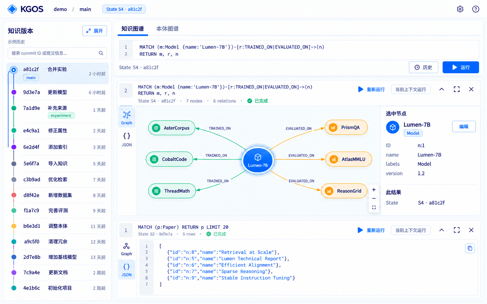
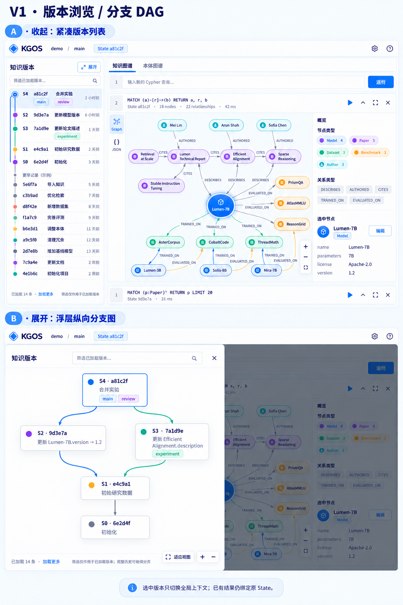
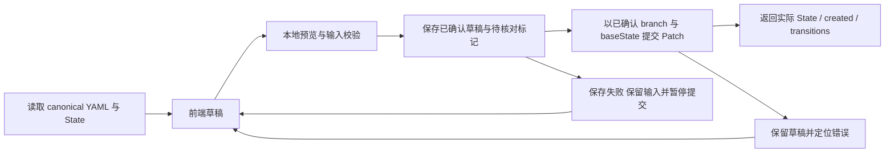

# Web 设计

<!-- cspell:ignore libfile WCAG -->

本文拥有 KG OS **面向人的 Web 信息架构、图形阅读、查询结果帧、版本导航、前端编辑与连接交互**。产品定义见 [README](../../README.md)，职责索引见 [设计入口](../design.md)。数据与写入规则继续由 [Ontology](ontology.md)、[Object](object.md)、[Graph](graph.md)、[Evolution](evolution.md) 拥有；交付与认证边界由 [Runtime](runtime.md#web-hosting) 拥有。

## 依据与状态

2026-10-04 核对基线：`main@181628b45c1600476514dfc129a5053c6d394b9e`，版本 `0.2.1`。此为设计提交时基线；当前 [Web 工作区](../../packages/web/src/shell.tsx) 正按 [Phase 14](../development/phases/14-web.md) 实施。本文不是页面已交付或交互验收报告。后端依据是当前 [SDK](../../packages/sdk/src/client.ts)、[类型](../../packages/sdk/src/types.ts) 和 [HTTP adapter](../../internal/daemon/api.go)，而非截图按钮。

| 状态 | 本文处理 |
| --- | --- |
| 用户已认可 | 图谱优先；白 / 浅灰 / 蓝视觉；左侧紧凑版本列表与覆盖式纵向 DAG；顶部新查询编辑器；最新优先的独立结果帧；帧内图 / JSON 切换、概览与对象检查器；显式进入简单编辑；旧帧重跑原 State；Branch 前进提示刷新、不自动切换；Web 数据与草稿保存在 Workspace 的 `.kgos` 下并可恢复 |
| 沿用现有产品合同 | 全世界 immutable State、同 State 读取、Definition 聚合、strict base Object Patch、Graph 原样执行与 Evolution 专用操作 |
| 本次工程方案，实施中 | 帧状态、图投影、分页接入、表单到 Patch、局部校验、手动 token 输入与内存保存、错误反馈、键盘与窄屏规则；`.kgos/web/ui.db`、可丢弃结果缓存、受控 Web 数据 API 与按记录并发校验 |
| 本轮决定更新 | 用户接受前两项默认，并追加“数据可以放到 kgos 下面，Web 临时数据也放里面”；按现有 Workspace→`.kgos` 合同理解，草稿不再默认随刷新丢失。随后明确“再简化点，不要过度设计”：首版只呈现常用工作流，保存 / 恢复在原编辑位置，缓存自动管理，普通错误就地短提示，真实冲突才打开比较。内部安全与持久化合同保留，均不代表已经实现 |

### 功能式设计材料

视觉材料统一按 Q / E / O / V / R / A 功能组织，入口见 [Web 功能材料与覆盖矩阵](web-materials.md)。该索引管理十四张功能 / 任务示意、五张状态组件规范、来源与规则引用，不对应十四个产品页面；交互语义仍由本文拥有，数据与写入继续依所属 owner。PNG 已齐套，R1 / R2 已按本轮简化决定替换；本页嵌入两张入口图，不表示应用实现或动态验收完成。

离线浏览材料可使用[功能图册 PDF](assets/web/KGOS-Web-Design.pdf)，主功能画板与状态组件 / A1 适配附录分别组织；图册不建立额外页面或产品能力。





图中的 State 符号、短 hash、时间、实体与计数是注明范围的设计示例；JSON 阅读示意不能作为 wire 编码，图中的动作不能建立额外 API。原件和组件变体的适用范围、来源版本及局部核对项统一见材料索引；一致数据见 [Web 样例](web-examples.md)。

## 信息架构与当前上下文

主界面有一条轻量顶部栏、左侧版本区域和右侧工作区。顶部显示 KG OS、当前 Instance 的本地连接、用户选择的 Branch / Tag / State 与完整 resolved State 的可展开标识；设置只承载连接和显示选项，帮助链接现有操作指南。没有账号头像、角色、权限分级或远程部署入口。

右侧的“知识图谱 / 本体图谱”是主导航。知识页由新查询编辑器与结果帧流组成；本体页直接展示 Domain / Definition 图与所属视图的检查器。版本详情、两 State 差异和 Merge 是从版本区域进入的任务视图，保持图与对象差异优先，不建立传统表格后台。

首版围绕版本选择、知识 / 本体阅读、查询及独立结果帧、显式编辑与提交。自动保存和恢复就在原编辑位置，用小标识说明正在保存、已保存或需处理的问题；不增加恢复中心、缓存管理页、容量面板或回执中心。连接使用简短 dialog；完整 YAML / Patch、执行摘要和技术诊断按需展开。导入 / 导出、整份 UI 数据清理与容量维护保留为工程 / operator 合同，不设为首版常驻入口或恢复必经步骤。

普通失败在发生处显示简短原因，只提供当前适用的重试读取、重新连接或继续编辑。原始 code、失败阶段和存储诊断可在详情中查看；写入结果未知先核对，不显示盲目重试。只有实际内容差异、记录 CAS 冲突或后端 Merge conflict 才进入相应比较；不能为完整展示状态规范而常驻多组错误卡或确认面板。

当前上下文是前端页面状态，不是新的服务器对象或 connection-local checkout。它保存用户所选 StateRef、解析后的 immutable State，以及需要写入时显式选择的目标 Branch。它不能把浏览中的历史 State 当作 Branch head，也不能从 Branch 轨道颜色猜写入目标。

| 操作 | 读取上下文与展示规则 |
| --- | --- |
| 选择 Branch / Tag / commit | 用 `evolution.get({state: StateRef})` 解析；成功前保留旧视图并显示“正在切换”，失败不替换已可用上下文 |
| 在知识 / 本体间切换 | 新建视图使用同一个 resolved State；所有后续 `at`、Domain 翻页和对象读取传该 commit |
| 选择另一版本 | 成功后改变新查询和新本体视图的上下文；旧结果帧保留原 State、数据、选择与视口 |
| Branch 后续前进或 Tag 被移动 | 已解析 commit 仍可解释原数据；显示观察到的指针目标，不静默改写历史帧 |
| 从旧帧进入本体或对象历史 | 链接携带该帧 State + Ref；显示局部历史上下文，不能用顶部当前 Schema 解释旧节点 |
| 查看历史 / Tag / 明确 commit | Snapshot 阅读模式只读；继续编辑须显式选择或创建 Branch，并建立符合其 head 的新草稿 |

切换期间，顶部上下文、本体视图、每帧执行与每帧选中对象分别拥有 request generation；响应只能更新自己所属的 generation。顶部切版本不废弃仍在运行的旧 State 帧；检查器更新还核对帧 State、当前 selected Ref 与 selection generation，A→B 选择后 A 的迟到详情不能覆盖 B。跨帧缓存的键至少含当前连接的库绑定、State + Object Ref；布局位置、折叠和选择属于对应帧。当前版本更新不批量清空或重新查询所有旧帧。观察到 Branch 前进时提示刷新，用户显式刷新 / 选择版本后才改变当前上下文；不自动跟随 head。

跨 Web / CLI 的指针变化用现有接口观察，不假定推送：已连接且页面可见时，约每 15 秒通过 `branch.list / tag.list` 读取当前关注类别的完整有界列表，再按所选 name 对照目标；当前没有独立的 per-ref head 读取接口，不为轮询调用包含一致性诊断的 `evolution.get`。ref 列表打开时更新其标注，关闭时仅更新所关注目标和提示。页面重新聚焦 / 变为可见、显式检查更新、恢复连接及本页 mutation 后立即核对；同一观察任务不重叠，失败退避、隐藏 / 断开时停止。显示最后观察时间，检查失败标指针信息可能过期，不把旧观察值写成最新 head；不替换 pinned commit 或旧 cursor。所选 ref 被删除时标“引用已不存在”，仍可按原 commit 读取就继续只读浏览，草稿不能提交到不存在的 Branch；不能静默切回 main。State Data / Merge 详情需显式重读其 mutable metadata，不用 commit 缓存充当最新值。

## 版本区域

### 紧凑提交列表

左侧保留独立滚动、搜索 / 过滤、“展开”和渐进加载。每条显示拓扑节点、彩色轨道、短 hash、提交摘要、时间及当前指向该 State 的 Branch / Tag 标签。选中的浏览 State 与 Branch head 用不同文字 / 图形标记；短 hash 仅用于显示，复制与请求使用完整 `commit/<64-hex>`。

时间使用 immutable `committedAt`（UTC epoch microseconds）转换为显示时间；State Data 不用来冒充提交摘要或提交时间。缺少 message / author 时显示缺省说明。轨道由已加载 parents 推导，不能将所有祖先标成某个 Branch 的专属数据；ref 标签来自独立 Branch / Tag 枚举，且可能晚于该 Snapshot。

`ancestry` 提供 topology，`history` 提供 scope / 对象变更，两者不能互相代替。历史筛选支持 `all / ontology / knowledge / object`；对象范围携带合法的 anchor State + Ref。hash / message / author 文本过滤目前仅针对已加载 ancestry，界面明确标为“已加载历史内搜索”；没有匹配时可清除筛选、继续加载或用完整 StateRef 直接定位，不能宣称全历史无匹配。过滤结果保留必要父节点或标明跨过滤连接，不能造出新 parent 边。

按可见行 / 节点与少量预加载范围设置 limit，首屏可从约 20 条开始，使用现有 opaque cursor 继续加载；接口允许 1..1000，省略时为 100。列表只挂载可见行和缓冲范围，追加按完整 State 去重。现有 cursor 顺序前进，不承诺按画布坐标或任意历史序号随机跳页。cursor 绑定已解析 root，Branch 前进时提供“加载新 head”的入口并重新开一组分页，不混用旧 cursor。历史加载失败留在版本区域；左侧搜索与知识 Cypher 输入不是同一功能。

### 覆盖式纵向 Git DAG

展开为**不透明白色抽屉**，带阴影、淡背景遮罩和可见关闭按钮。抽屉叠在现有左侧与工作区之上；开关不改变底层工作区盒子尺寸、结果帧图尺寸或相机，不调用 fit-to-view、不重新计算知识图布局。展开状态锁住背景交互和页面滚动；查询可继续运行，返回数据不会触发背景自动缩放。

抽屉内部是真正纵向 DAG：遵守 ancestry 的 reverse-topological 顺序，以 `parents[]` 连接 fork / merge，合并节点保留全部已知 parent 边，分叉占独立轨道。由新的 State 向更旧 parent 连接；箭头图例说明“parent”，不借截图方向推导业务关系。多 root 不默认合成全库 DAG；选择 Branch root 后只看其可达 ancestry，其他 Branch 可单独切换 root。

未加载 parent 画为明确的继续加载端点，不能假装不存在或补假节点。只渲染可见节点、连线与少量边界缓冲；大历史不一次下载或布局全图。泳道较多时允许抽屉内部横向平移 / 滚动，摘要与标签可折行，保持父边可追踪；不将所有节点压成不可读的单列。

列表与 DAG 的选择键都是完整 State。展开前定位选中行，展开后把对应 DAG 节点置于可见区域；关闭恢复列表滚动锚点。相同节点使用连续位置 / 高亮过渡，保留底层所有帧的视口；减少动态效果时使用稳定淡入。该过渡是需原型测量的设计要求，静态图不是通过证据。

关闭按钮、遮罩、Escape 使用相同关闭路径；不改变选中 State。点击 DAG 节点只改变当前浏览上下文，抽屉是否保持打开由本次阅读操作控制，不将关抽屉等同提交或切换 Branch。焦点规则见[键盘与响应式](#键盘与响应式)。

## 知识查询工作区

### 编辑器与结果帧流

顶部始终有“新查询”编辑器，支持多行 Cypher、参数 JSON、格式清晰的运行状态与当前读取 State。主动作“运行查询”调用只读 `graph.query / streamQuery`；另有明确的“高级执行”模式选择目标 Branch，调用 `execute / streamExecute`。不按语句关键字猜读写、不自动将 query 失败升级为 execute。

每次运行创建一个独立帧并插在流顶部，旧帧可以折叠。用户正在读较旧帧时保持滚动锚点并提示有新结果，不自动抢焦点或跳到顶部。重跑另建帧，原帧仍是原执行记录；编辑历史语句时用“复制到新查询”或帧内重跑入口，不能让原结果搭配后来改过的文本。

每帧拥有：执行语句与 params、读取或执行模式、输入引用、resolved State（执行帧还区分执行前观察值与结果 State）、状态、前端测得耗时、已接收行数、去重图元素计数、局部结果与视口。耗时从请求发起到 terminal / 失败，明确是客户端观察值，不伪装成数据库 profiling。创建帧用前端局部标识，不发明持久 KG OS Object。

运行时一次性冻结所见语句、解析后的 params、明确模式、目标 commit / Branch 和输入引用，作为新帧请求快照；后续编辑输入或切版本不修改它。上下文切换尚未完成时，主运行与按当前版本新跑都暂停，避免显示新引用却读取旧 commit；解析失败仍保留可用旧上下文，由用户明确恢复后运行。

工程编码同时保留合法参数对象的原始 JSON 文本，帧保存、显示、复制及重跑使用这一冻结来源，避免 Number 重新编码把 `1.0`、`-0.0` 或大整数改变为另一 Lithograph 值。HTTP 请求通过 SDK 的同请求精确 JSON 选项发送；缓存指纹使用该来源解析的参数值。没有此可选来源的旧记录沿用既有 params，不补造已丢失的数字格式。

帧头提供重跑、折叠、全屏、关闭；运行中显示取消。折叠保留语句、State、状态和计数，运行仍继续；全屏只扩大当前帧，退出恢复原位置与图相机。运行中关闭的动作写为“取消并关闭”，不能用移除 DOM 冒充后端取消成功。关闭一个完成帧不删除知识、State 或其他帧。

取消先记录本窗口的取消状态，再 abort 原请求；关闭还设置 closed 并失效该帧执行 / 邻居 / 属性请求 generation，abort 这些请求。更新 rows、计数、选择、缓存或 autosave 前均检查对应生命周期，已经缓冲的 row / summary 不能把取消帧改成正常完成、重新打开关闭帧或覆盖另一帧。正常完成已确认的记录不因随后关闭改成取消。关闭状态通过该记录的 CAS 保存；迟到回调不使用最新 revision 回写旧整条记录。仅停止 async iteration 不等于取消 HTTP，必须沿同一个 AbortController 的 signal 中断。

图谱、原始 JSON / 行结果、写入摘要都在该帧内切换。多个帧之间不共用选中对象检查器，不增加全局底部 console，也不让切换图 / JSON 改变其他帧。

### State 固定与重跑

读取在新帧创建前从当前上下文取得 immutable commit，并传给 query 的 `at`。这也解决现有 NDJSON `columns / row` 未带 State、仅 `summary` 返回 State 的问题：流中可以显示“读取 State”，完成后核对返回的 `summary.state`；不一致按协议错误处理。邻居展开、属性详情和本体链接使用同一帧 commit。

历史只读帧的重跑入口必须清楚区分“按原 State 重跑”和“按当前 State 新跑”，展示将使用的 commit，不能默默换数据。**主动作按原 State，菜单提供按当前 State 新跑，均另建帧。** 当前 State 解析未完成时禁止后者。原帧无成功结果、但已有 pinned read commit 时也可按原 commit 重跑；原 State 已不可读时保留记录并显示实际错误，不自动换当前版本。

高级执行只有 Branch 上下文，没有 `baseState`；不能提供“在原历史 State 写入”的重跑。再次执行须明确显示目标 Branch、重新观察的 head 与原语句，由用户触发；观察 head 不构成 CAS 保证。允许改到另一 Branch 时必须显式选定；不自动重试 execute。结果 State 仅由成功返回的实际 summary 确定，不假定一定新建一个 State。

任意 execute 的 rows 仍服从底层 procedure / transaction 语义，不能一概当作最终 `summary.state` 的一致快照。执行前观察的 head 不是 pinned read base；未成功返回 summary 时结果 State 未知。从执行帧继续探索或简单编辑，先在实际返回 State 新建只读查询帧并重新读取对象，不把执行 rows 直接装入只读 State 缓存。

### 查询状态与反馈

| 状态 / 输入 | 帧内表现与可用动作 |
| --- | --- |
| 解析上下文 / 开始请求 | 显示目标引用和正在解析 / 执行；没有结果时显示占位，不借上次帧数据填充 |
| 流中收到 rows | 增量更新行数及图，标“接收中，结果未完整”；绘图批量刷新、有界缓冲，不逐行强制全图重排 |
| 唯一 summary 且流正常结束 | 标完成，显示实际 State；零 rows 为“查询完成，0 行”，不是断流；非图 rows 进入 JSON；summary 后还有数据按协议错误处理 |
| 用户取消 | `AbortController` 对该请求 abort；保留已收 rows，标“已取消，部分结果”，取消不表示结果完整 |
| non-2xx / terminal error | 就地显示简短失败说明与适用动作；已收数量保留，公共 code/message 与失败阶段放在可展开详情。SDK 将 NDJSON error 转为异常，不能当数据行 |
| 解析错误 / 缺 terminal / 断连 | 标“结果不完整”及连接 / 协议原因；保留部分结果，不显示完成或“0 行” |
| 达到图投影 / 接收预算 | 图投影受限只标显示范围，原 rows 在接收预算内仍可读取；接收触顶主动 abort 并标部分结果。两者不能冒充完整服务端分页 |

取消是 HTTP request 的中断路径，当前没有独立 query-id cancellation endpoint。只读帧的部分数据仍来自 pinned State，但不代表完整查询结果；允许查看已收到的完整元素及在该 State 另发邻居查询。新增邻居结果作为该帧的“展开结果”计数，与原查询 rows 分开；失败只影响本次展开。

写入取消、断流或响应丢失可能已有 durable 副作用，显示“执行未完整返回，写入结果待核对”，不能写“已撤销”。语法错误、底层验证错误和 transport 错误保留原 code；前端不自行猜已提交范围。

### 接收与显示预算

当前 SDK 的 NDJSON reader 会先缓冲整条 event 再 JSON.parse，HTTP 的 16 MiB 是请求体上限，都不能保证浏览器响应内存有界。Web 使用现有 `KGOSClientOptions.fetch` 注入点包装响应流：在 SDK 解码前按 UTF-8 bytes 计数、把交付 chunk 切成不超过 32 KiB，单 NDJSON event 初值不超过 1 MiB；未知规模的 Graph 默认用 streaming。非 streaming JSON / 缓存读取也在解析前限制响应为 16 MiB，容纳单条 8 MiB 记录及 envelope，超限完整失败，不展示截断 Object 表单；显式 SQLite 下载是独立下载流，不送入 JSON decoder。包装保留 SDK 的唯一协议解析器，不复制 error / value decoder，也不改变 CLI / 第三方 SDK 默认合同；实现见 [Web adapter](../../packages/web/src/transport.ts)，实际验收范围由阶段记录维护。

初始前端预算为每帧最多保留 8 MiB 完整 rows 编码或 10,000 rows，整页 rows 最多 32 MiB，同时活跃流不超过 4；本窗口新运行超出并发数时排队并显示冻结的请求上下文，可取消待执行任务。达到接收 / rows 预算时主动 abort，保留已确认接收的部分，标前端预算原因、取消 / 不完整；没有正常 summary 与 EOF 就不标完成、不写完整缓存，execute 仍标写入结果待核对。这些是可调整的工程初值，不是准确的 JS heap 上限或已验证容量。

每幅图初值最多显示 1,000 Node / 2,000 Relationship；投影采用有界迭代，最多访问 100,000 个值、嵌套深度 64，超出显示投影范围而不构造假完整图。仅图投影受限且原 rows 完整时，JSON 仍可显示完整已保留结果；接收截断时二者均是部分。JSON / 长属性只渲染当前展开片段，显示预览截短不改写原值。大整数与 tagged values 的原编码保持保真。

整页预算不足时先释放关闭 / 折叠的已完成帧 rows，再释放其他当前不可见已完成帧，保留语句、State、状态和原计数；不淘汰草稿或默默重新查询。重开时显式按需加载完整缓存，缺失仍按原 State 另建帧重跑。邻居展开共用所属帧的接收 / 图预算，不能绕过上限；无法释放时不启动新增请求，已运行请求按接收预算规则 abort 并标部分结果，不建立暂停 / 恢复查询语义。邻居超限只结束本次展开，保留原查询已确认的完成状态；完整缓存只保存原查询完整 rows / columns，不混入部分展开结果。实际堆内存、布局性能和流处理压力需在实现后验证。

### 图投影与帧内检查器

从 Lithograph JSON v1 的真实 typed Node / Relationship / Path 值提取图元素；支持同一 row 内的标量、List / Map 和图值共存。只读帧按该帧 State + element identity 去重，不按 name/title 合并节点，不把含 `$type` 的普通业务 Map 猜成图实体。保持原 rows 供 JSON 查看；不把 scalar、Vector 或任意嵌套字段造为新 Object。相同 identity 出现不一致 payload 时不拼成一个虚构对象；高级执行中这类结果保留 JSON，并提供在实际 State 重新查询的入口。

关系方向、single Type、真实 `start/end` 和多重边来自结果本身；自环 / 平行关系可区分和选中。只返回关系而缺端点详情时，先显示标注为“未加载”的 endpoint 占位，再按该帧 State 查询；不能补造 Label / Property 或全局相邻关系。图中隐藏或筛选只是帧内展示，不修改 query rows 或 Knowledge。

右侧检查器属于当前帧。未选中时显示**当前帧已显示子图**的 Label / Type 分布、元素数和范围；选中节点显示 element identity、全部 Labels 与类型保真的 Property，选中关系显示 identity、一个 Type、方向、两个实际端点及 Property。多 Label 的分类数可能重叠，不能相加当节点总量。空 Label 节点用“无 Label”显示，不隐式套 Definition。

“扩展邻居”通过参数化、有界的只读 Cypher 返回该元素邻接子图；查询使用帧 State，明确本次 limit 与范围，不宣称独立 traversal / neighbor API。展开保留现有元素位置和选择，新元素局部布局，不自动 fit。画布提供缩放、回到选中项与显式适配范围；拖动布局不写入知识库。

“查看属性”用原 typed value，必要时用 `object.read` 获取公共 Object；简单编辑前额外使用 `object.readText` 取得 canonical YAML。Graph 可返回内部图或高层不支持的值，仍可查看原结果；只有成功按公共 Object profile 读取的对象可进入高层编辑，无法解释时给出能力原因，不伪装为可保存表单。

节点显示文案是前端展示配置，不新增通用的 Knowledge `title/name` 必填规则；缩略标签可用调用方数据中的合适字符串，完整 Ref 和全部属性仍可查阅。样例主题色不是固定业务类型系统。

### 高级执行与无图写入结果

对应画板见 [E3 高级执行与安全边界](assets/web/E3-raw-cypher-safety.png)。

高级模式的执行入口与 Object 编辑分开。执行前显示目标 Branch 和原语句，并说明直接 Cypher 使用底层事务 / procedure 合同；无通用 preview、strict base、affected IDs 或高层 Schema/Binding 修复保障。此处不是 Neo4j Bloom 的可视化写入模型。

有真实图返回时可显示图；只有 scalar / map / rows 时显示 JSON；无 rows 时显示**写入 / 执行摘要**：实际 `state`、后端返回的 counters（存在时）、语句与完成状态。缺失的 counter 不能填成零，counter 不能转换成 affected Object 清单。执行未创建 Commit 时如实显示返回的原 State。

后续通过新查询定位相关对象，用户可复制语句或已知业务条件到新编辑器；不依据计数虚构选中节点、不保证自动高亮所有改动。若 execute 返回的数据涉及无法解释的 Snapshot，可通过 `evolution.get.consistency` 诊断；高层读取失败不能被 UI 自动修复或掩盖。

## 前端草稿与提交

### 显式编辑工作流

简单编辑是 KG OS 自有前端能力，以 Object 合同实现。检查器的“编辑”、图工具的“新建节点 / 新建关系”、删除入口先进入草稿；查看属性、双击展开和拖动节点不触发写入。编辑状态可留在帧的检查器中，预览 / 提交面板属于该草稿任务；编辑成功不把旧查询帧改成新 State。

编辑表单附近只保留保存状态、简短变更摘要和明确的提交动作；canonical YAML 对照与完整 Patch 按需展开。下面的保存顺序是内部可靠性流程，不要求用户走多步向导、单独点击保存或进入回执中心。提交前仍须展示并确认本次具体变化、Branch 与 baseState。

对应画板见 [E1 对象草稿](web-materials.md#功能覆盖矩阵)与 [E2 Patch 预览及回执](assets/web/E2-patch-submit-receipts.png)；图稿局部修订状态以材料索引为准。



一个草稿绑定 Instance、immutable `baseState`、目标 Branch、base canonical bodies 和显式修改。跨 Ontology + Knowledge 的同一次编辑可以形成一个通用 Object Patch；只有模型修改时可用 `ontology.patch` 的 kind 限定入口。不存在每个 Property 的私有保存按钮、服务端 staging area 或第二套 JSON Patch。

已存在对象先在草稿 base 读取 canonical YAML，表单保留未知于 UI 但公共合同支持的 typed value，避免数值精度、null / 缺失或复合字段顺序丢失；前端无法无损编辑的字段保持只读并说明。生成普通 Git Extended Diff，base 文本来自 `readText`，不拿 Graph JSON 直接当 diff base。新增顶层对象使用 `new:<kind>:<alias>`；同请求新建关系可引用新节点 alias，成功才获得正式 `n:/r:`。

预览展示用户明确的新增 / 改动 / 删除、canonical YAML 对照与待提交 Patch，并列已知依赖和影响范围。输入校验覆盖空值、重复字段 / Label / Ref、合法类型、参数 JSON、Definition 最少一个字段等能在本地确定的内容；结果标“前端检查通过 / 失败”。现有 API 没有独立 dry-run / validate / preview；数据唯一性、约束收紧、引用与最终事务校验仍由真正提交时的 Kernel / Lithograph 完成。前端不能显示“全库数据验证通过”或完整迁移影响清单。

提交按钮显示目标 Branch 与完整可展开 baseState，用户确认本次具体变更后调用 Patch。提交期间抑制重复动作并保留原草稿；无 effective delta 返回原 State，不能把它当作新提交。成功只依据返回 `state / created / transitions`，映射新增 alias 与直接 Ref transition，保留旧帧供核对，提供“查看新 State / 刷新当前分支”的显式动作，不自动切换顶部当前版本。知识提交与 Web 记录保存没有共同事务，恢复边界见[保存与知识提交](#保存与知识提交)。

### 节点、关系与删除影响

| 变化 | 草稿 UI 与现有合同 |
| --- | --- |
| 新建 / 编辑 Node | Labels 是 0..N 集合；Property 按真实 typed value 编辑，element identity 只读；业务唯一键来自已确认模型 |
| 新建 Relationship | 一个 Type、实际 `start/end` Node Ref；表单将 Definition endpoint 约束与实例端点分开；允许同请求 alias |
| 改 Relationship Type / endpoint | 显示可能 replacement，直接修改的对象以返回 transition 导航；不能承诺旧 `r:` 永久有效 |
| 删除 Relationship | 只删除明确这条关系；新 State 中移除，原 State 保持可读 |
| 删除 Node | 有 incident Relationship 时 reject，除非同 Patch 明确删除或重构这些边；不自动 DETACH DELETE |
| 批量派生关系 replacement | 不承诺全部旧新 Ref 一一 mapping；新 State 重新查询，Diff / History 查看集合变化 |

删除预览显示已知对象、目标 State / Branch、明确选择的依赖处理；当前帧的部分子图不能当全库依赖计数。可按 baseState 增发有界只读查询辅助核对，未完整获取时标范围未知。任何直接 Cypher detach 行为只能在高级执行由用户明确写出，不混入高层删除按钮。

### 草稿状态与恢复

| 情况 | 处理 |
| --- | --- |
| 草稿未提交 | 有显著“前端草稿”标识与修改数量；没有新 State，也不移动 Branch |
| 切换对象 / 页签 / 版本或关闭编辑器 | 已确认保存的草稿自动保留，正常离开不反复确认；只有尚未确认保存的输入才提示可能丢失并允许取消离开。显式放弃另行处理；保留的草稿仍绑定原 Instance / Branch / baseState，不能带到另一个目标直接提交 |
| Branch 任意前进 | 预检查或提交报 `STALE_BASE_STATE`；保留文本、显示原基底与最新 head；无关对象的提交同样使基底陈旧 |
| 重新建立草稿 | 用户阅读新 base 对照后手动迁移修改，重新生成 canonical diff；不自动 replay / rebase / merge |
| 本地 / 后端校验失败 | 在原表单定位公开 Ref / 字段路径并给出短提示，保留输入；后端没返回具体对象或数量时不补造影响明细 |
| 提交取消 / 超时 / 断连 | 标“结果未知”，先读 Branch、相关对象与历史核对；当前无 request idempotency / submission-status API，不盲目重发 |
| 断连或 401 | 保留本窗口未确认保存的输入和 daemon 已保存版本；暂停服务器动作，重新连接后重新检查保存 revision、Branch / baseState |
| 刷新 / 浏览器重开 / daemon 重启 | 重新认证后从当前 `.kgos` 恢复已保存草稿到原编辑位置；尚未确认保存的输入仍可能丢失，离开提示仅针对这部分，不通过恢复中心或导入 / 导出完成正常恢复 |
| 恢复旧草稿 | 重读原 `baseState` canonical bodies，再检查 Branch head；陈旧、原 State 不存在或 base bytes 不符时保留文本，禁止直接提交，不自动 replay |

导出 / 导入保留为补充维护资料合同，不属于首版用户恢复流程：文件保留格式版本、来源库绑定、原 Instance locator、baseState、Branch、精确 base bodies、编辑后内容与 Patch，不含 token。未来接入导入时只创建恢复副本，不执行或覆盖同 ID 草稿；先核对当前库、原 base 与 Branch，再允许预览。动态 endpoint 仅是 locator，不能证明库归属；新增 Web 数据方案使用 daemon 的实际库绑定，仍不提供浏览器跨端口发现或全局物理 Instance identity。

## Web 工作区数据

自动恢复与真实多窗口冲突见 [R2 工作区恢复](assets/web/R2-workspace-recovery.png)，开发状态规范见 [R2 状态表](assets/web/R2-states.png)。正常恢复留在原编辑位置，状态表不建立异常管理入口；材料已按本轮简化决定修订，持久化实现及验收记录见 [Phase 14](../development/phases/14-web.md)。

### 存储基线与目录

现有 [Runtime](runtime.md#instance-root) 固定一个 Workspace 对应 `<root>/.kgos`、一个 `kgos.db` 与最多一个 daemon；当前 [路径实现](../../internal/runtimeprofile/profile.go)、[HTTP adapter](../../internal/daemon/web.go) 和 [SDK](../../packages/sdk/src/client.ts) 已接入 Web 存储工程合同；下列规则的跨平台与完整交付验收由 Phase 14 维护；“保存到 kgos 下”不另建顶层 `kgos/`。

```text
<root>/.kgos/web/
├── ui.db             # 持久 UI、查询记录、收藏与草稿
├── ui.db-wal / -shm   # 普通 SQLite 的运行文件（如采用 WAL）
└── cache/            # 可删除的只读结果缓存与写入临时文件
```

`ui.db` 是 daemon-owned operational 数据，用现有 Go SQLite driver 打开普通 SQLite，采用 WAL 与 `synchronous=FULL`，不调用 Lithograph Host、不加载图扩展、不添加 Knowledge 表。它与 `kgos.db`、Embedding Provider 的 `.kgos/cache/` 分开；UI 保存不创建 State、不移动 Branch、不进入 Ontology / Knowledge、Snapshot Diff / Merge，也不使用 [State Data](evolution.md#state-data可修改的状态注释) 的每 State 注释槽。

浏览器只经当前 daemon 的受控 API 访问；不能读取本机文件或指定 root、文件路径、SQL、外部 URL。服务端从已解析 Instance Directory 定位固定目录，仅接受规定的 record kind 与 UUID ID；缓存文件名由服务端产生。Web 目录和文件采用当前用户私有权限（POSIX `0700/0600`，Windows 对应私有访问控制），拒绝 Web 管理目录内的路径逃逸与符号链接重定向。Bearer 仍只在当前页面内存和 HTTP header 中，`auth.json` 不复制到 UI 库、缓存、导出或日志。

### 持久记录与可丢弃缓存

| 数据 | 保存内容与生命周期 |
| --- | --- |
| `workspace` | 当前浏览引用及 pinned commit、页签、版本列表滚动锚点、显示设置；恢复 pinned 上下文，再提示已观察到的新 head，不自动切换 |
| `editor` | 尚未运行的 Cypher、参数编辑文本和明确模式；语法未完成也可保存，不因 JSON / Cypher 不合法而丢输入 |
| `frame` | 查询历史与独立执行记录：原语句 / params、模式、原 read commit 或 execute Branch / 观察 head / 实际返回 State、完成 / 部分 / 未知状态、原计数 / 耗时；帧顺序、开关 / 折叠、选择、相机与布局位置。Graph 大结果不放这里 |
| `query` | 用户显式收藏的命名查询及参数模板；使用它只填入编辑器，执行前显示明确上下文，不自动执行或新增领域模型 |
| `draft` | 库绑定与 UI 草稿 subtype。Object 草稿保留 Branch、immutable baseState、Ref / alias、精确 base canonical bytes、编辑文本、已生成 Patch（若有）与提交状态；Merge / State Data 的未发送输入见下文。非法或未完成文本也保留，显式放弃或核对提交完成后才处理，不设 TTL |
| 结果缓存 | 仅成功完整接收、未截断且有 pinned commit 的只读 rows / columns；键含 storeId、databaseId、commit、精确查询 / 参数及值编码版本。缓存有界且可重建，不能作为 Patch base 或高层对象编辑来源 |

持久记录无自动 TTL 或 LRU 删除；关闭帧只保存关闭状态，普通“清查询历史”不能连带删除草稿 / 收藏。删除草稿、收藏或清全部持久 UI 的工程能力需明确列出类别与数量、由用户显式操作；“清结果缓存”只清 `cache/`，整份清理不设首版独立管理入口。UI 记录引用 commit 不成为数据库 GC root，不隐式创建 Tag / Branch / Merge Session，因此原 State 以后可能不可读；仍保留文本并提示原版本不可用，详情保留 `STATE_NOT_FOUND`，不把持久 UI 承诺成永久保留知识历史。

`draft` 复用同一个记录 / CAS / 无 TTL 生命周期，用 subtype 区分已有编辑任务，不要求非 Object 输入提供 canonical Patch base：Merge 草稿保存 session token、pinned targetState / sourceState、最后观察的 Session revision，以及按 opaque conflictId 记录的未发送 choice / 原始 value 文本；State Data 草稿保存 immutable State、观察到的 hasData / data、set / clear 意图与原始 JSON 文本。它们只记录前端输入，不建立第二套 Merge Session 或 State Data。恢复 Merge 先 `get / conflicts` 核对 Session、revision 与 conflictId；变化、已完成 / 消失或 pinned State 不可解释时保留文本供比较，不自动套到新 Session、resolve 或 finalize。恢复 State Data 先重读该 State 的当前 sidecar，展示与观察值的差异；提交仍是明确的 set / clear，现有 API 没有 sidecar CAS，UI revision 不提供后端并发覆盖保护，也不自动 setData。

删除记录在同一 UI transaction 中清空 `data`，tombstone 仅保留 kind / id / revision / deleted / mutation metadata。删除 frame 同时使关联缓存逻辑失效：read 返回 miss，晚到 write 被拒绝，文件清理可 best effort。清查询历史按所列 frame 删除，不能只隐藏列表却继续提供旧缓存；同样不删除其他草稿或收藏。查询正文、参数、结果及草稿是可能敏感的用户内容，会按上述范围落盘 / 导出；连接 token 与 Authorization 字段不属于任何 UI payload，缓存与导出临时文件也采用同一私有权限并在完成 / 失败后清理。这里定义逻辑清理，不承诺擦除原文件、外部备份或导出副本的物理残留。

初始工程预算：单条记录 JSON UTF-8 不超过 8 MiB，有效持久记录及 deleted-ID metadata 的逻辑编码总量不超过 64 MiB；SQLite 页面与 WAL 另设 256 MiB 合计空间预算，按需 checkpoint，空间不足或无法在预算内提交时拒绝保存，不通过删除 tombstone 腾空间，也不宣称文件大小恰好等于 JSON 预算。预算超出返回 `RESOURCE_ERROR`，保留上一份确认版本和本窗口输入；不截短 YAML、自动删旧草稿或改变 Knowledge API 的大小边界。首版在原编辑位置提示未保存，具体用量与维护诊断按需查看，不增加容量面板或清理 / 导出流程。结果缓存总预算 128 MiB、单项 8 MiB、写入后 TTL 7 天，后台按 LRU 自动淘汰；超大的完整结果仅保存帧 metadata，不能截断后冒充完整缓存。缓存参数是可调整工程初值，不是结果永久保存承诺。

缓存使用临时文件完整写入、同步并原子发布，失败时视为 cache miss；不能让缓存失败抹掉草稿或阻断已有 Kernel 能力。恢复完整结果用小标识说明来自已保存结果，元素数写当前实际载入范围；缓存缺失 / 过期时保留原执行 metadata，在原帧显示“结果暂不可用，可重新运行”，提供按原 State **另建帧**重跑，不能自动补跑。缓存原因放在详情，不要求用户管理缓存清单。任意 Cypher 可读取外部文件 / 服务，固定 commit 也不保证重跑还原原执行 rows。execute、取消、部分流与结果未知不存完整结果缓存，也不自动执行恢复。

### 库绑定、格式与恢复

UI 库的 metadata 至少含独立 `formatVersion=1`、随机 `storeId` 和 daemon 启动时已验证的 Lithograph `databaseId`；record 含 `kind/id/revision/deleted/data/lastMutationId`。`revision` 是递增的十进制字符串，客户端只作相等比较，不转换为可能失真的 Number；`data` 是各 kind 的 versioned JSON payload，草稿文本原样保存。SQLite 保存与 Knowledge State 无共同版本号或事务。`storeId` 只识别这一份 Web 存储的创建 / 显式重置，不是 Object Ref、StateRef 或新物理 Instance 身份。

每个 daemon 只打开自己 `.kgos` 下的 UI 数据。内部 `databaseId` 当前已存在，但Web API 从 Runtime 已验证的 Host baseline 取得该绑定。换端口不会改变目录归属；目录内换成不同 databaseId 的 `kgos.db` 时保留旧 `ui.db`，仅允许读取 / 导出其恢复资料，禁止套用到新库或继续保存。v1 不提供浏览器整体 reset / 文件替换接口；operator 明确停止 daemon 并完整归档旧 UI 库及其运行文件后，下一次 Web 请求才可为当前库建立新 storeId。数据库和整份 Workspace 的复制可能保留 databaseId / storeId，不意味着同一物理实例；不同 Workspace 各自管理本地记录，不按相同 ID 跨目录合并。完整备份恢复也要重新检查 State / Branch。

Web 存储首次缺失可在已认证 Web 请求中创建空库，不能加入 `init` / Kernel readiness 的前置条件。首次创建由 daemon 内互斥串行化，在同目录私有临时 SQLite 完成 schema / metadata transaction、关闭并同步后原子发布；失败不把半建文件发布成 `ui.db`。已有库先核对格式 / 库绑定，再启用正常读写 / WAL 或明确迁移；现有文件损坏、库绑定不符或未来格式不支持时保留原文件并报告，不能静默重建空库。格式版本独立于 KG OS package / Lithograph storage format；只进行有明确迁移器、事务校验及可恢复原件的升级，失败保留旧数据，未知更高版本只读诊断 / 导出并返回 `UNSUPPORTED_OPERATION`。UI 子系统故障不阻断已有 Ontology / Object / Graph / Evolution API。

刷新或浏览器重开先重新提供 Bearer，再读取当前 daemon 的 Web store 和持久记录；Browser storage 不作为恢复真源。恢复帧不自动跑查询；本窗口没有原请求的连接时显示“未连接原执行，结果待核对”，不把共享运行中记录写成中断 / 终态，因为另一窗口可能仍在接收流。实际持有请求的窗口根据 summary、失败或中断更新执行记录；恢复窗口可显式重读记录。原提交中草稿同样作为结果待核对恢复，不能推断请求失败。恢复 Object 草稿先在原 commit 读取 canonical bodies，核对精确 bytes 和目标 Branch head；原 base 不存在、与当前 renderer 不一致、Branch 不存在或 stale 时保留输入、禁止直接提交，用户可对照新 base 手动重建。视口 / 选中 Ref 在对应帧 State 重新加载后才恢复可用状态，不能用顶部新 Schema 解释旧选择。

### 受控 API 与多窗口保存

本轮新增方案使用 SDK `web.data / web.cache` 和 POST `/api/v1/web/data/*`、`/api/v1/web/cache/*`，与当前业务 API 共用 Bearer 和错误 envelope。实现见 [SDK](../../packages/sdk/src/client.ts) 与 [HTTP adapter](../../internal/daemon/web.go)，验收结果见 Phase 14。 请求继续受现有 16 MiB transport 上限约束；单条 8 MiB 预算避免全工作区 replacement，list 只返回轻量 headers，默认 100、1..1000、opaque cursor。UI list 是存储记录分页，不是全历史搜索或 Object discovery。

| 调用 | 最小合同 |
| --- | --- |
| `web.data.info({})` | 已认证后总能返回本次进程的 daemonBootId 与 storageStatus（ready / unavailable / unsupported / mismatch）；可安全读取时才附 formatVersion、storeId、保存 / 当前 databaseId、bindingStatus 和用量，否则附共享错误诊断，不猜字段。库绑定不符时只开放恢复读取 / 导出。daemonBootId 用于下文连接失效校验，不依赖 UI 库成功打开 |
| `web.data.list({storeId, kind, limit?, cursor?})` / `read({storeId, kind, id})` | list 返回 kind/id/revision/deleted 等 headers，read 返回单条完整 record；cursor 绑定 storeId/kind 与该分页快照，不复用到新一组读取 |
| `web.data.save({storeId, kind, id, expectedRevision, mutationId, data})` | 新记录用新 UUID 和 `expectedRevision=null`；已有记录用最后观察 revision。daemon 在同一 SQLite transaction 比较并发布新 revision，只有 commit 确认后才返回“已保存” |
| `web.data.delete({storeId, kind, id, expectedRevision, mutationId})` | 仅删除明确记录并清空正文，保留 deleted ID/revision 以拒绝旧窗口重新创建；重用已删除 ID 不视为新建。批量清理逐条显示实际成功 / 失败，不宣称跨条原子 |
| `web.data.export({})` | 从固定 `ui.db` 生成一致、压缩的 SQLite 副本，包含已提交内容而不带已删除正文的 free pages；使用服务端固定临时路径的 `VACUUM INTO`，成功后才下载，不把原文件 / WAL 直接打包，也不接收路径。有效但较新格式 / 库绑定不符时不解释 payload，仍可导出逻辑原件；压缩 / 备份失败明确报错，保留原件、不降级为带残留的普通副本。响应为下载流，SDK 返回 Web Platform Blob |
| `web.cache.write({storeId, frameId, frameRevision, result})` / `read({storeId, frameId})` / `clear({storeId})` | 只读完整帧的 best-effort 缓存；result 保留 typed rows 和对应 state。服务端限制 typed 格式 / 大小、绑定帧 / 库 / commit；write 的 frameRevision 是写入前可靠确认的帧 revision，拒绝修改后迟到的结果。只改变视口等展示信息但查询指纹未变时保留原缓存；不存在或 deleted frame 的 read 返回 miss，write 拒绝，不接受文件名 / 任意路径 |

record ID 与 Web store metadata不成为公共 Object；autosave 只验证存储 envelope、kind 的 UI payload shape、格式及预算，不要求其中的草稿是有效模型或可提交 Patch。保存失败使用[Web 持久数据错误方案](contracts.md#web-持久数据错误方案)，不能用 `STALE_BASE_STATE` 代替 UI revision 冲突。

导出使用压缩副本是清理合同的工程编码：[SQLite VACUUM INTO](https://www.sqlite.org/lang_vacuum.html) 提供一致的逻辑副本并去除删除内容；普通 [Backup API](https://www.sqlite.org/backup.html) 的按位快照不具备同样的删除清理边界。临时副本不加载 extensions、不依赖可变 ROWID 作 UI record identity，未完成时不提供下载；实际 driver 与跨平台验证范围见 Phase 14。

编辑约 500ms 无新输入时保存，一条记录最多一个 in-flight 请求；新输入保持 dirty，旧响应只确认发送时那一版。编辑器附近用小标识显示“正在保存 / 已保存 / 未保存”；保存冲突或结果未知时给出适用的局部处理，不展开常驻诊断卡。未确认保存才显示离开提醒，浏览器关闭事件不被当作保证可完成最后写入。响应丢失后 read 对应 ID，核对 `lastMutationId` 与内容，不能仅因 revision 增加就声称本窗口已保存；未能核对前保留本地输入，暂停依赖可靠保存的提交。

不同记录独立 revision，两个窗口修改不同草稿可以分别成功。同一记录竞争返回 `WEB_DATA_CHANGED`，保留两侧版本，本窗口重读后才打开局部比较，由用户保留新 ID 副本或选择版本；不能“拿新 revision 再发送旧整条数据”自动覆盖他人。deleted ID 也拒绝旧保存；operator 归档后建立的新 storeId 使旧窗口停止保存并先核对恢复资料、保留输入。共享的 workspace / editor / frame 记录同样服从 CAS；各窗口的当前显示不因别处保存自动切 State、替换语句或跳视口。UI revision 与 Knowledge baseState 是两项独立校验，UI 保存成功不证明 Patch base 仍是 head。

### 保存与知识提交

用户确认时冻结本次 Branch、baseState、精确 canonical bytes 与 Patch；先可靠保存这一版及“提交结果待核对”标记，收到确认后才发送一次该版本的 Object Patch，不能等待保存后再从可变表单重建请求。最小实现从确认至本次保存 / 提交不再在途暂时禁用本草稿修改，保留原文；前置保存失败则恢复编辑并暂停提交。结果未知仍先核对，不因恢复编辑重发旧请求；后置回执不能把未包含的输入标为已完成。此记录不是服务器 staging 或 submission-status 服务，不能证明 Patch 已收到或已执行，也不改变 Kernel 的提交合同。

Patch 成功后立即显示真实 `state / created / transitions`，再保存提交回执及草稿完成状态；后者失败只报告“知识已提交，Web 回执未保存”，不能把它改成知识失败、回滚或重发。恢复待核对标记时先读取 Branch、对象与历史核对，不自动重试 Patch；新建 alias 的正式 Ref 若未可靠保存，不能根据名字猜 mapping。execute 的 Branch / 原语句与结果未知记录同样可保存，但仍不获得 strict base、统一 all-or-nothing 或自动重试能力。

## 本体图谱

对应材料见 [O1 组织导航](assets/web/O1-ontology-organization.png)、[O2 聚合编辑](assets/web/O2-definition-aggregate.png)与 [O2 状态表](assets/web/O2-states.png)；示例变体的适用范围见 [材料索引](web-materials.md)。

本体页直接用图形展示 Node / Relationship Definition、Domain 组织与字段 / 约束 / 索引 / 端点。全局与 Domain 导航沿用 `ontology.read`，详情与编辑通过同 State 的 `object.read / readText` 获取结构化 aggregate，不解析阅读 Markdown 来保存字段。

Node Definition 用类型卡片，Relationship Definition 用可选中的关系定义标识及端点连接；连接含义是**类型端点约束**，不是某个 Knowledge 实例。`from/to=null` 显示“此端不限制类型”，不画错误端点、假 Node Ref 或假 Any Definition。`name` 是 identifying name、`title` 是显示名，缺 title 时回退 name；Ref 全程带 kind。

端点 Definition 位于当前 Domain 外时也显示准确 Ref 与可跳转的端点引用；需要详情再在同 State 读取，未加载时明确标注。不能因当前组织阅读范围隐藏跨 Domain 关系。

Domain 用独立形状与组织连线展示 `includes`。有多父 / cycle 时复用相同 Ref、visited-set 去重、有界展开，显示已展开 / 未加载范围；无 Domain 时未归类 Definition 仍可发现。Domain membership 不能画成 Knowledge 关系、权限或 namespace。Domain 翻页必须使用返回的 resolved State + 该 Domain cursor，不递归下载全模型。

Definition 检查器展示自身说明、Node 附加 Labels 或关系 from/to、Property 类型 / required / unique、具名 Constraint 和实际 Index 名称 / targets / properties。Property / Constraint / Index 只在所属 Definition 聚合内部展开编辑；共享 Index 在多个参与 Definition 显示同一个完整资源与全部 targets，不创建独立顶级 CRUD。

| 模型变化 | 用户必须读到的规则 |
| --- | --- |
| 字段 / 约束 / 索引 | Node / Relationship Definition 均至少一个字段；required、unique、key 与索引分别展示；unique 不是关系基数 |
| 收紧类型、required、unique、附加 Label 或 endpoint | 可能与现有 Knowledge 冲突，提交失败时保留草稿；不自动加 Label、填值、删重复或迁移关系端点 |
| 改 title / description | 只是说明变化，不伪装成 identity rename，也不复制到 Knowledge Object |
| 改 identifying name | Definition / Domain 用显式 Git Rename entry；Property 用所属 Definition 的 `renameFrom`；按返回 transition 与新 State 重读 |
| 共享 Index 调整 | 修改 targets 改覆盖范围；显式删除整条声明会全局删索引，预览显示全部参与 Definition，不写“仅移除当前引用” |
| 删除 Definition / Property | 无隐式 Knowledge 删除；剩余实例值 / Schema 依赖必须同 Patch 明确处理，否则 reject |
| 删除 Domain | 只删除组织与自身，不删成员 Definition / Knowledge |

单字段规则、复合规则与共享规则的放置遵守 [Ontology 公共格式](ontology.md#propertyconstraint-与-index-的组织)。只能跨 Definition 共享 Full-text / Managed Semantic；Range / Text / Point 保持 Definition-local。索引 `vector` 在本体表单显示为托管语义索引，不给 Knowledge 加内部向量 Property，不新增 `filterProperties`、cardinality 或 per-index options。

全局 / Domain 结果有准确 `total` 和 cursor 时显示其范围总量；Definition 详情不分页，超限就是错误，不能展示截断表单并允许保存。模型读取失败与空模型分开；invalid Snapshot 显示 `get.consistency` 诊断，Graph 原始结果仍按其能力可用。

## 版本详情、差异与合并

对应材料见 [V2 State 详情](assets/web/V2-state-detail.png)、[V3 State Diff](assets/web/V3-state-diff.png)、[V4 Merge](assets/web/V4-merge-session.png)与 [V4 完成及并发状态](assets/web/V4-merge-outcomes.png)。图中的展示标签与 API 字段映射见 [材料索引](web-materials.md)。

### State 详情与两 State 差异

State 详情显示 immutable metadata、parents 与当前 mutable State Data，二者分组。State Data 使用通用 JSON 编辑，区分 absence 与显式 null；不定义固定 title/stage 字段、不让它进入 Snapshot Diff / Merge。修改 sidecar 仅改变注释，界面不能显示新知识版本。显式 `state.create` 可创建 Snapshot 无变化的新 State；空 Diff 不等于没有该 State。

Diff 明确选择 before / after 的 resolved State，使用 `evolution.diff`，按 `all / ontology / knowledge / object` scope 分页展示结构化 Change。中心图以新增 / 删除 / 改动与图例叠加，检查器展示 public path 与 before / after；颜色同时配文字或线型。跨 State 元素用各自 identity；只有明确的 Ref continuity / rename 证据才连为同一对象，不靠同名匹配。

Change 可能只包含字段片段，不能从一个 scalar before/after 补造完整图对象。需要图形详情时按两侧各自 State + Ref 分别 batch `object.read` 或受限 Graph 查询；删除对象从 before 读，新增对象从 after 读，1..100 Ref 的 batch 边界与缺失错误原样处理。未加载完整详情时只显示已知变更范围。

对象过滤携带 `anchorState + ref`，anchor 必须是 before 或 after；History 的 anchor 必须在 root ancestry 内。删除对象显示“这一侧不存在”；无差异、对象不存在、invalid State 与读取失败分别提示。分页范围不冒充全库变化数，筛选变更类型目前在已加载结果内进行。**Evolution 结构化 Diff 不是可直接提交的 Git Extended Diff**；草稿 Patch 的文本预览是另一个明确任务。

### Branch 与 Tag

用独立 ref 列表读取各目标并在图中标注。创建 Branch 必须显式 from，历史只读视图可“从此 State 创建分支”；新建 Branch 不修改原 Snapshot。Tag create / move 必须选目标，move 明确展示旧目标与新目标；普通写入不移动 Tag。删除只操作 ref，不写成删除所有历史 State，失败保留输入并显示实际错误。

当前专用 Branch API 只有 list / create / delete，不能用截图推导 rename、reset 或任意 move；Tag 才有专用 move。ref enumeration 现有接口没有 cursor，前端可以过滤 / 虚拟化已返回项，但不能宣称有服务端 ref 分页。操作后读真实列表核对；多调用方期间显示的旧目标只是观察值，不虚构这些 mutation 的 expected-head 参数。

### Merge Session

Merge 面板明确目标 Branch 与 source StateRef；`start` 后显示后端实际 pinned `targetState/sourceState`、session、revision、status 与 unresolved。当前公共结果没有共同基底字段，不能画一个保证准确的“唯一共同基底”或依据截图编造它。

冲突通过 `conflicts` 分页读取，按 opaque `conflictId` 选择 ours / theirs / value，显示公开 Object Ref、path、relatedRefs 与 base / ours / theirs。absence 与显式 null 分开；同一 path 的多条 conflict 不合并 ID。未发送的解决输入是前端提案；成功 resolve 更新的是 operational Session，不是知识 State。

resolve / finalize / abort 都携带最后观察到的 `expectedRevision`。resolve 成功后更新 revision 并丢弃旧 conflict cursor，保留未发送输入待核对。`MERGE_SESSION_CHANGED` 重新读 Session；`BRANCH_HEAD_MOVED` 保留方案并显式重建 Session，不自动重放。校验失败展示公开错误，Session 保留且不声称 Branch 已前进；无法安全解释的 conflict 按一致性错误处理。

未解决冲突阻止完成；完成动作调用 `finalize`，由后端对精确 revision candidate 做一致性检查。按实际 status 显示 `up_to_date / fast_forward / merged`，只有 merged 创建两 parent State。关闭面板保留可恢复 Session，list / get 可重开；显式“放弃合并”才 abort，不把关闭当 abort。状态失败 / 结果未知不自动重复 finalize。

## 连接、认证与恢复

沿用 [Runtime 单 Token 实例认证](runtime.md#单-token-实例认证)与 [SDK 显式 token](client.md#kgossdk)。正式 Web 与 API 使用当前 daemon 的同源动态 loopback endpoint；浏览器没有读取 `.kgos/kgosd.lock / auth.json` 的特权，不默认扫描端口、自动启动 daemon 或重新定位另一个 workspace。

本次最小适配方案是：用户按本地 Runtime locator 打开当前 endpoint，在简短连接 dialog 手动提供当前 Instance 的完整 Bearer token；输入遮蔽，token 只存在当前页面内存，构造 SDK 后对 API 发 Bearer。顶部正常只显示简短连接状态，endpoint 可展开查看；boot ID、库 ID 与原始错误码不作为日常主显示。页面刷新或显式“断开并清除凭证”清除内存；不放 URL、cookie、localStorage、草稿、日志或设计示例。浏览器自动交接凭证、持久保存与跨端口恢复未被假定为现有能力。

对应材料见 [R1 显式连接](assets/web/R1-local-connection.png)、[R1 状态表](assets/web/R1-states.png)与 [R1 / R2 覆盖矩阵](web-materials.md#功能覆盖矩阵)；连接与持久化实现的验收记录由 [Phase 14](../development/phases/14-web.md)维护。

Web 工程适配检测 daemon 生命周期：每次进程启动生成内存中的随机 UUID `daemonBootId`，首次显式连接通过 `web.data.info` 取得；之后 Web 借现有 SDK 的 `fetch` 注入点对全部 API request 携带 `X-KGOS-Expected-Daemon-Boot`。HTTP adapter 在 Bearer 认证后、执行操作前比较该可选 header，不符返回 `WEB_CONNECTION_CHANGED`，Web 暂停读取 / autosave / mutation、保留输入并要求显式重新连接，不能自动重新获取 boot 值接着发送。没有 header 的现有 CLI / 第三方 SDK 合同不变；Web bootstrap 的无 header info 仅发生在用户显式连接时，尚未取得 boot 值前不发其他操作。

此 guard 已在 HTTP adapter 与 Web fetch 接入，不是第二个 secret、账号权限或稳定物理 Instance identity。它解决完整复制 `.kgos` 保留 token / databaseId / storeId、另一个 daemon 复用旧端口时旧页面继续发送的情况；正常 daemon 重启也会失效，用户重新连接后再按原 store / 库绑定核对恢复。daemonBootId 不进 UI 持久记录或导出，不用 endpoint、PID 或持久 ID 冒充进程生命周期。

| 连接状态 | 页面行为 |
| --- | --- |
| 未提供凭证 / 正在连接 | 连接面板说明本地 Instance；显式连接的 authenticated `web.data.info` 取得 boot / store 诊断，再用带 guard 的 `overview` 读取 ref 与 State；UI 存储故障时 info 仍可返回进程 guard 与存储诊断，不能因此停用 Kernel 浏览 |
| 正常 | 显示简短连接状态与已解析 State，endpoint 在详情中可查，不展示 token；只承诺单完整权限 credential |
| `AUTHENTICATION_FAILED` / 401 | 显示“凭证不可用，重新连接”，暂停服务器动作、清除失效内存 token、保留草稿；不能猜成账号过期或承诺刷新 token |
| `WEB_CONNECTION_CHANGED` | 显示“连接已变化，请重新连接”，停止旧连接操作并保留输入；显式重新连接后才取得新 guard，不能自动跟到端口复用的另一目录 |
| 连接拒绝 / 超时 / daemon 停止 | 保留只读结果与页面草稿，标离线 / 结果不完整；提供重试读取与当前本地操作指南 |
| SDK 协议 / NDJSON 解码失败 | 就地报告响应异常，不替换成空知识库；保留已完成帧 |
| 恢复连接 | 显式重新连接、取得本次 boot / store 绑定，读取目标 Branch 与 State，重新检查草稿 base；查询重试可用，写入不自动重试 |

daemon 重启可能改变端口但复用 token。旧页无法凭浏览器现有 API 自动发现新端口，用户重新打开当前 locator、再次提供 token，然后从同一 `.kgos/web/ui.db` 恢复已保存记录；未确认保存的输入在当前页保留，连接恢复后再核对并保存。此处不新增账号、role/scope、rotation API、LAN 或公网部署方案。

## 视觉与交互规格

白色面板、浅灰 / 很浅蓝背景和蓝色主动作保留认可方向。彩色节点与轨道用于类型 / 拓扑辨认，配图例和标签；页面不采用 Neo4j 深色外观。下列数值是可调的前端初始规格，语义名称是 Web 样式参数，不改变数据合同。

| 用途 | 初始规格 |
| --- | --- |
| 页面 / 面板 / 图背景 | `#F6F8FC` / `#FFFFFF` / `#F8FBFF`；常规面板细边界，抽屉不透明 |
| 主文本 / 次文本 | `#172554` / `#52627A`；不可用信息仍可读，不用过浅灰替代说明 |
| 主动作 / 选中 / focus | `#005FCC` + 白字；选中背景 `#EAF2FF`，focus 独立可见，不仅更改背景 |
| 错误 / 警示 / 成功 | `#B42318` / `#854D0E` / `#067647`，搭配图标和文字 |
| 分隔 / 边界 | `#D7E2F2` 用于装饰；关键输入边界、图边与可交互对象需另测对比，不仅依赖浅色线 |
| 字体 | 本机系统 sans-serif（含中文 fallback），代码 / hash 使用系统 monospace；不依赖外部字体请求 |
| 字号 / 密度 | 正文 14–16px，辅助与代码不小于 12px，行高 1.5；4 / 8 / 12 / 16 / 24 / 32px 间距 |
| 初始桌面尺寸 | 顶栏约 56px，版本列表 280–340px，帧检查器 280–320px；抽屉宽约 640–880px 且不超过 viewport |
| 圆角 / 动效 | 常规面板 8–12px，节点按图形类型区分；反馈约 120–180ms，列表↔DAG 约 180–240ms，尊重减少动态效果 |

Graph 数量始终写明当前返回 / 展开 / 已显示范围；没有后端总量就不写全库节点 / 关系数。按钮用明确动词，disabled 附原因；仅当当前对象适用时展示对应动作，不以静态按钮存在证明可执行。长 name/title/hash 可截短展示但完整值可复制；说明、错误、JSON/YAML 支持折行 / 内部滚动，typed value 不因显示格式丢精度。

图标可紧凑显示，但动作点击区至少 44 × 44px，触控入口留足间隔；选中 / 运行 / 禁用有可见反馈。必要操作不能仅在 hover 出现，节点上下文动作同样有键盘和触控入口。

### 键盘与响应式

对应材料见 [A1 窄屏、缩放与焦点](assets/web/A1-responsive-accessibility.png)；缩略帧的 Q1 组件复用约束见 [图示简化](web-materials.md#图示简化与实现约束)。

桌面主流程全部可键盘完成：新查询、运行、取消、帧折叠 / 全屏 / 关闭、版本选择、DAG 导航、对象选择、草稿预览 / 提交、冲突解决。编辑器内 `Cmd/Ctrl+Enter` 执行所见明确模式；普通 Enter 保持换行，快捷键不抢走浏览器全局操作。图节点和关系提供帧内可访问对象导航，焦点、选择与读取顺序可知；缩放 / 适配按钮替代纯滚轮，位置调整不要求必须拖动。

抽屉按模态 dialog 处理：有标题与关闭名称，开启后焦点进入抽屉，Tab / Shift+Tab 在内循环，背景 inert，Escape 关闭，返回展开按钮或逻辑接续位置。全屏帧保留自己的关闭 / 退出动作与键盘焦点；先关闭最上层，不一键丢弃多层编辑。依据 [WAI-ARIA dialog pattern](https://www.w3.org/WAI/ARIA/apg/patterns/dialog-modal/)。

新结果到达、执行状态和验证反馈用节制的 live status，不逐 row 播报；错误摘要可链接到字段。单靠颜色不能区分类型、Branch、diff 或错误；图标按钮必须有可访问名称。正常文字目标对比至少 4.5:1，关键交互 / 图形边界至少 3:1；数值需在实际实现中测量，不能从静态图宣称已达标。

在 200% 缩放和窄窗口，版本列表可收为覆盖入口，帧内检查器改为该帧下方可折叠区域，工具栏换行；每帧保持自己的选择和检查器 ownership。更窄屏以单列编辑器与帧流阅读，DAG 抽屉占可用宽度。图 / DAG 保持二维平移区域，但表单、说明、连接面板不要求页面双向滚动；支持 320 CSS px 阅读和长文本重排，依据 [WCAG Reflow](https://www.w3.org/WAI/WCAG22/Understanding/reflow.html)。桌面尺寸与动态转换仍需真实浏览器验收。

<a id="当前能力与待确认项"></a>

## 当前能力与工程待办

### 接口能力核对

以下是 2026-10-04 工作树接口与 Web 接入核对结果；实际验收范围见 [Phase 14](../development/phases/14-web.md)，不能从接口存在推断所有平台已通过。HTTP method 均为 POST，使用同一个 Bearer credential。

| UI 需要 | 当前 SDK / HTTP | 前端责任或缺口 |
| --- | --- | --- |
| Ontology 概览 / Domain / Definition | `ontology.read` → `/api/v1/ontology/read` | 图布局、直接成员分页与范围提示；无 Ontology search |
| 公共对象 / canonical base | `object.read / readText` → `/api/v1/object/read`、`read-text` | 结构化检查器与表单，保留 typed values；无 object list/search |
| 统一高层提交 | `object.patch / ontology.patch` → 各自 `patch` | 本地草稿、Git Extended Diff、strict base 反馈；无独立 preview/validate 或提交状态接口 |
| 查询 / 执行 / NDJSON | `graph.query / execute / streamQuery / streamExecute` → `/api/v1/graph/query`、`execute` | 图投影、非图 JSON、write summary；现有 fetch 注入点可适配 Web 有界接收，预算 reader 已接入，动态验证见 Phase 14；无 affected IDs 或保证的图返回 |
| 取消 | SDK `RequestOptions.signal` + HTTP disconnect | 每请求 AbortController；无 query-id cancel，写入副作用不能由取消推断 |
| 版本导航 / 详情 | `evolution.overview / get / ancestry / history` → 对应 `/api/v1/evolution/*` | 先 pin、DAG 虚拟化、局部文本搜索；summary / parents 不含 State Data 的快照内容 |
| 两 State 差异 | `evolution.diff` | 结构化 Change 图与字段对照、有界分页；不是提交 Patch 文本 |
| Branch / Tag / State Data | SDK `evolution.branch / tag / state` → 对应 route | 原样接现有操作；Branch 无专用 move/rename，ref list 无 cursor |
| Merge | SDK `evolution.merge` 的 start/list/get/conflicts/resolve/finalize/abort | 精确 revision 工作流与恢复；无公开共同基底字段或高层全局影响预览 |
| 连接 | SDK 显式 `endpoint/token`、fetch 注入点与 401 公共错误 | 手动输入、页面内存 credential及可选 boot guard 已接入；无浏览器自动凭证交接、稳定 Instance identity 或跨端口发现 |
| Web 持久 UI / 草稿 / 结果缓存 | `web.data / web.cache` 与固定 `.kgos/web` SQLite store | 按[本轮存储与 API 方案](#web-工作区数据)实现 daemon adapter 与 SDK；不借用 State Data、Knowledge Patch 或任意文件接口 |

高层模型、身份与生命周期沿用对应 owner；Web 工程接入、局部可视化及 UI 存储 / API 已实现，剩余验收与实际阻塞由 Phase 14 记录。下列默认行为已按用户本轮决定更新。

<a id="待确认产品选择"></a>

### 已确认默认与本次持久化方案

| 默认行为 | 已确认方向与工程处理 |
| --- | --- |
| 只读历史帧重跑 | 主动作按原 State 另建帧，另提供“按当前 State 新跑”；两者清楚标 commit |
| Branch 前进或本页写入成功 | 当前视图保持 pinned，仅提示刷新；成功后提供“查看新 State / 刷新当前分支”显式动作，旧帧保持原 State |
| 跨刷新恢复 Web 数据与草稿 | 用户已认可数据放在 KG OS 目录；本轮在已有 `.kgos/` 下设计 `web/`，隔离持久 UI 与可淘汰缓存。已保存记录重新认证后恢复，草稿无自动 TTL；尚未确认保存才提醒可能丢失 |
| 首版交互范围 | 用户已要求简化：保存 / 恢复留在原编辑位置，缓存后台自动管理，普通失败短提示，真实内容 / CAS 冲突才比较；不设恢复中心、缓存 / 容量管理页或常驻诊断卡，维护导入 / 导出 / 整份清理不进入首版常用流程 |

token 的手动输入 / 内存保存、记录 CAS、格式与分页、预算 / 缓存 TTL、错误映射与组件尺寸属于本次工程实现；动态与交付验证见 Phase 14。自动交接 credential 或远程部署需另有明确需求和合同，当前不为它新增接口。

### 设计自查与后续动态验收边界

本文和样例按以下有限用例核对。文字与资产核对可确认方案一致性；交互、性能、后端集成的实际证据及未验证边界由 Phase 14 维护，不在此新建开发阶段。

| 场景 | 应观察到的结果 |
| --- | --- |
| 当前版本从 S1 切到 S2，再切知识 / 本体 | 新视图同用 S2；旧 S1 帧仍可扩展 / 查看 S1 数据，不静默更新 |
| 图结果、混合 / 标量结果、零行、取消、terminal error、断流 | 只影响相应帧，图 / JSON 局部切换，只有 summary 才完整成功 |
| 无图 execute、取消写入、响应丢失 | 实际 summary 或结果未知；无 fabricated IDs、预览或“已回滚” |
| 新建 / 编辑 / 删除节点关系，历史浏览 | 草稿与提交分离；0..N Labels、single Type、无隐式节点 detach，历史只读 |
| 收紧 Schema、删除共享 Index、Domain cycle | 聚合内编辑、影响范围明确、数据冲突不自动修复、有界去重展开 |
| Branch 无关前进、Patch no-op、直接关系 replacement | stale 同样拒绝；no-op 无新 State；仅使用实际 returned transition |
| 大历史、多泳道、筛选无匹配、抽屉开关 | 可见范围渲染、继续加载 parent、过滤不造边、背景尺寸 / 相机不变、选择连续 |
| Diff 空 / 删除 / rename，Merge revision 或 head 改变 | 公共 structured changes、合法 anchor、opaque conflictId、旧 cursor 作废、不自动 replay |
| 401、daemon 换端口、已保存草稿恢复 | 保留已有输入、重新连接、恢复到原编辑位置、重新核对 base / Instance、不自动重发 mutation |
| 刷新 / 重开、缓存过期、原 State 不存在、两窗口保存竞争 | 已确认保存的记录恢复；无缓存不补跑；保留失效 base 草稿；同记录 CAS 冲突不覆盖，UI revision 不替代 strict base |
| 保存 quota / I/O 失败、较新格式、不同 databaseId、Patch 成功但回执未保存 | 原件与输入保留、UI 故障不阻断 Kernel；不把知识成功改成失败，也不把较新格式或换库当空 UI 重建 |
| Tab / Escape、减少动态效果、200% zoom、320px、长文本 | 焦点可达可见、遮罩不漏焦点、关闭返回触发点、二维图与可重排表单分开处理 |

Neo4j 仅提供查询交互参考：[Browser visual tour](https://neo4j.com/docs/browser/visual-tour/) 的编辑器、结果帧和可滚动流帮助表达本页结构；[经典 result frame](https://github.com/neo4j/neo4j-browser/blob/master/docs/modules/ROOT/images/graph-result-frame.png) 与 [Aura Query 图](https://github.com/neo4j/docs-aura/blob/console/modules/ROOT/images/query-tabs.jpg) 是不同界面的对照来源。KG OS 的版本 DAG、State、Object Patch、Definition 聚合与简单编辑依本仓库合同设计，不将 Browser 查询与 Bloom 写入混为同一能力。
